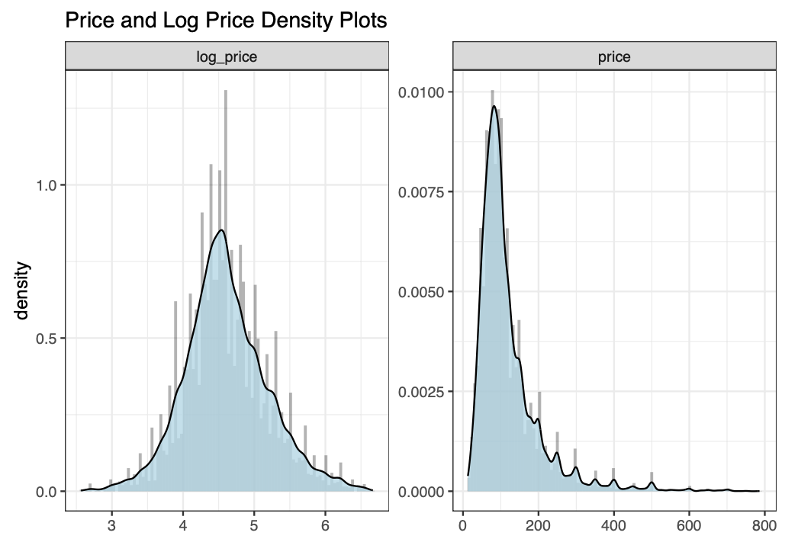
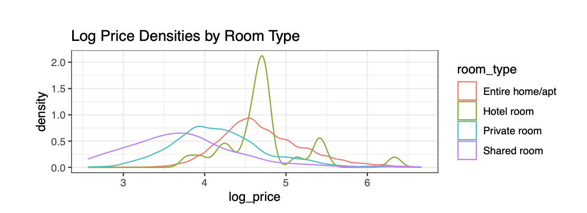
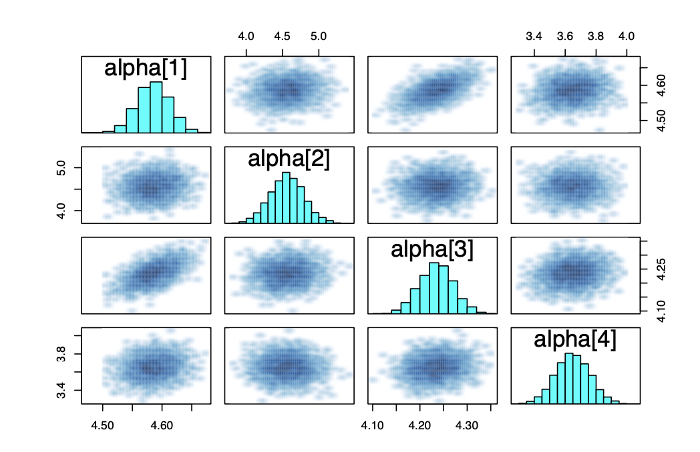
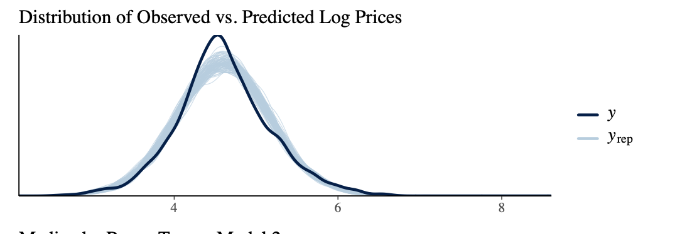
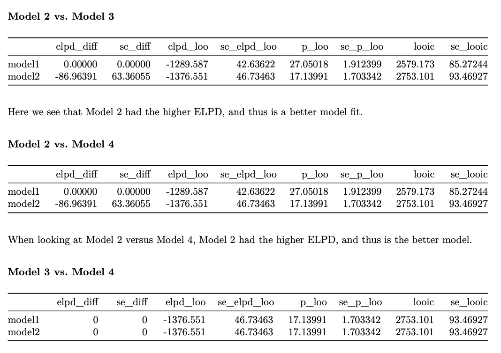

# Bayesian Modeling of Milan Airbnb Prices

## Project Overview

This project showcases an in-depth statistical analysis of Airbnb listing prices in Milan using advanced Bayesian hierarchical models. By examining how various factors—such as location, room type, and property characteristics—influence Airbnb pricing, this analysis provides valuable insights into the dynamics of the rental market in one of Italy's most iconic cities. The project not only demonstrates the power of Bayesian methods in handling complex, real-world data but also highlights their utility in making informed, data-driven decisions in the sharing economy.

### Key Components of the Analysis

1. **Data Collection and Preparation**:
   - The dataset was sourced from Airbnb, specifically focusing on Milan's listings as of December 2022.
   - After thorough cleaning and preprocessing, the dataset included 15,731 distinct listings.
   - Important preprocessing steps involved managing missing data, log-transforming the price variable to handle skewness, and encoding categorical variables for effective modeling.

2. **Exploratory Data Analysis (EDA)**:
   - The first step in our analysis was to explore the distribution of prices across different neighborhoods in Milan. The most expensive districts were found to be centrally located, aligning with expectations.
   




*Figure 1: Distribution of prices and log-transformed prices for Airbnb listings in Milan. Log transformation normalizes the skewed price distribution, making it more suitable for modeling.*

   - We also examined how log-transformed prices varied by room type, revealing that entire homes and apartments generally command higher prices than private or shared rooms.


   
*Figure 2: Log price densities by room type. Entire homes/apartments show the highest log-transformed prices, while shared rooms have the lowest.*

4. **Bayesian Modeling**:
   - Building on the insights gained from EDA, we developed several Bayesian hierarchical models to quantify the impact of different factors on listing prices. These models allowed us to account for variations both within neighborhoods and across different room types, providing a more nuanced understanding of the data.
   
   - Model diagnostics, including traceplots, were carefully reviewed to ensure proper mixing and convergence of the MCMC chains, which is crucial for the reliability of Bayesian estimates.


   
*Figure 3: Traceplots demonstrating the convergence and mixing of MCMC chains for model parameters, ensuring the reliability of the Bayesian estimates.*

   - We also compared the observed and predicted log prices, particularly analyzing the median predictions by room type, to assess the model's performance.


   
*Figure 4: Comparison between observed and predicted log prices across different room types. The model performs well overall, though it slightly overestimates prices for entire homes/apartments.*

5. **Model Comparison and Validation**:
   - To evaluate the effectiveness of our models, we used several diagnostic tools, such as effective sample sizes (n_eff) and Rhat values. Model performance was primarily assessed using the LOO ELPD (Logarithmic Out-of-sample Predictive Density) metric, with Model 2—grouping neighborhoods into broader areas—emerging as the best performer.

   - The following comparison highlights the superior predictive accuracy of Model 2 compared to other models.


   
*Figure 5: Comparison of LOO ELPD values across different models. Model 2, which groups neighborhoods into broader areas, offers the best predictive accuracy.*

## Results and Insights

- **Location Matters**: Central areas, especially Zona 1 (encompassing neighborhoods like Duomo and Brera), significantly increase Airbnb listing prices.
- **Room Type Influence**: Entire homes/apartments are priced higher than private or shared rooms, reflecting their premium value in the market.
- **Listing Characteristics**: Features such as the number of bedrooms, bathrooms, and the overall accommodation capacity are strong predictors of higher prices.
- **Review Scores**: While less impactful than location or size, factors like cleanliness and location ratings still influence pricing to a moderate extent.

## How to Run the Analysis

### Prerequisites

Make sure you have the following installed:

- R (version 4.0+)
- RStudio (recommended)
- Required R packages: `rstan`, `tidyverse`, `bayesplot`, `ggplot2`, `loo`

### Steps

1. **Clone the repository**:
   ```bash
   git clone https://github.com/yourusername/milan-airbnb-bayesian.git
   cd milan-airbnb-bayesian
2. **Install the necessary R packages**:  
   `install.packages(c("rstan", "tidyverse", "bayesplot", "ggplot2", "loo"))`

3. **Run the analysis**:  
   Open `scripts/main_analysis.R` in RStudio and run the script to preprocess the data, fit the Bayesian models, and generate the visualizations.

## Future Work

- **Temporal Analysis**: Incorporating temporal factors, such as seasonality, to model dynamic pricing strategies.
- **Cross-City Comparison**: Expanding the analysis to other major cities to uncover common trends and key differences in Airbnb pricing strategies.
- **Advanced Modeling**: Exploring more sophisticated Bayesian models or integrating machine learning techniques to enhance predictive accuracy.

## Conclusion

This project highlights the power of Bayesian hierarchical models in uncovering the factors that drive Airbnb pricing in Milan. The insights gained from this analysis can assist hosts in optimizing their pricing strategies and offer a solid foundation for further research into the economics of the sharing economy.
